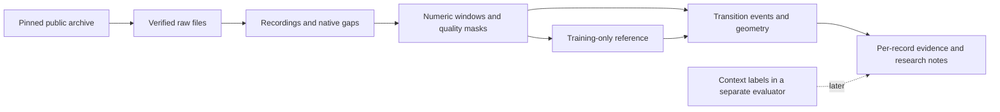

# EEGT continuous database

The database connects every derived observation to its original source file,
sample coordinates and frozen experiment. Raw samples remain immutable files;
SQLite stores the inventory and evidence needed to interpret the derived data.



## Files and boundaries

| Artifact | Contents | Role |
|---|---|---|
| `protocol/corpus-manifest-v1.json` | Pinned commits, source paths, content hashes, units, technical metadata, selection and prior-exposure flags | Curator inventory; never a discovery-model input |
| `data/cache/` | Original checksum-verified SET/FDT files | Immutable source cache; fetched from public archives, excluded from Git |
| `results/corpus-v1/corpus.sqlite` | Datasets, recordings, source files, channels, discontinuities and coverage view | Queryable source catalog; distributed as a release asset |
| `data/derived/003/*.npz` | Numeric feature matrices, validity, timestamps and segment indices | Reproducible derivatives, using non-executable NumPy arrays |
| `results/003/features.json` | Feature hashes, exposure and source/processing identity | Connects derived files to the frozen input bundle |
| `results/003/analysis.sqlite` | Catalog plus feature receipts, model references, transition events and per-record metrics | Queryable numerical evidence; distributed as a release asset |
| `results/006/` and `results/007/` | Control and transfer results linked by recording keys and hashes | Evaluation layer; no semantic labels sent back into discovery |

Each recording key is scoped to its source snapshot. Public participant IDs are
grouping keys, not proof of globally unique people. Removing names and labels
from input arrays does not remove all possible identity-related information
from EEG. No such inference is part of this study.

## Denominators

Count source participant records, sessions, recordings, source hours,
discontinuities, qualified records, all feature windows, QC-passing windows and
eligible scored contexts separately. A window is multichannel in Experiment 003;
Experiment 002 used per-channel windows. At a half-second hop, multiplying
eligible window centers by 0.5 estimates center-grid exposure, not independent
sample size or the exact union of valid raw samples. Missing and quarantined
sources remain visible.

```sql
-- Counts and decoded sample duration, including quarantine rows.
SELECT * FROM coverage ORDER BY dataset_id, status;

-- Source problems that must not disappear from the denominator.
SELECT dataset_id, source_subject, status, reason
FROM recordings WHERE status <> 'QUALIFIED';

-- Native gaps and boundaries, in source sample coordinates.
SELECT recording_id, start_sample, stop_sample, kind
FROM discontinuities ORDER BY recording_id, start_sample;

-- Individual numerical events; these are not clinical diagnoses.
SELECT recording_id, view, scale_seconds, time_seconds, score, geometry_json
FROM transition_events WHERE scale_seconds = 2.0
ORDER BY recording_id, view, time_seconds;
```

## Growing the corpus

1. Inventory a new public source version. Include only the around-ear EEG
   scope or explicitly create a new comparison protocol. Verify terms, technical
   fields, provenance, source-local participants and repeated-session structure.
2. Pin source content hashes and deduplicate payloads before choosing splits.
   Preserve missing files and failures. Do not count re-downloading an unchanged
   file or slicing more overlapping windows as new evidence.
3. Reserve new participants or sessions before examining signals. Repeated
   evaluation consumes a holdout; record that exposure in the next manifest.
4. Freeze a numbered protocol, acquire and qualify sources, run the unchanged
   baseline plus the new question, independently review, and publish a release.
5. Prioritize gaps the current corpus cannot answer: repeated sessions, genuine
   Neurable acquisition, contact/reseating variation and independently aligned
   context. Add meaning only through later blinded evaluation after discovery.

The current database has no proven Neurable capture, globally unique participant
census, repeat-session reliability estimate, clinical endpoint or universal
token geometry. These are research questions with separate acceptance evidence.
