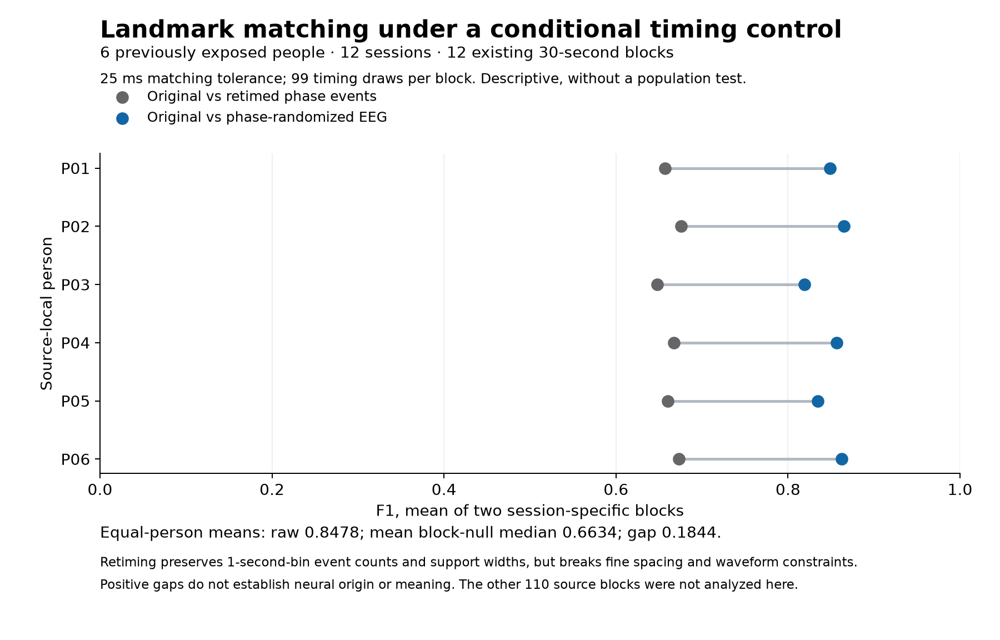

# Conditional timing controls on exposed waveform landmarks

**Exploratory follow-up to Experiment 012 · 2026-09-28.** The fixed protocol and numerical outputs passed independent scientific review. This analysis reuses existing detected events; it adds no source people or recorded hours and changes no published 012/013 endpoint.

At 25 ms matching tolerance, the mean block F1 for original versus independently phase-randomized EEG was **0.8477986**. Randomizing the phase-side event times within fixed one-second bins produced a **mean block-null median of 0.6634331**. The equal-person mean of the raw-minus-null contrasts was **0.1843655**. These are descriptive measurements on six source-local people and twelve existing blocks, with no population significance test.

## What was fixed

The tranche contains the lowest selected array row for each of six people and two sessions: twelve of the original 122 selected thirty-second blocks. Selection was frozen before reading their empirical control results. The remaining 110 blocks were not analyzed in this follow-up. There is one block per session, six minutes of already exposed selected signal time, and 228.672 seconds of common guarded support across the twelve blocks. Channel and event-stratum copies do not multiply exposure time.

Each block receives 99 timing draws. The null preserves phase-side event counts within each channel, event stratum and one-second bin, as well as event support width and common guarded interval. It replaces fine event timing with feasible uniform centers. The same draws are evaluated at 10, 25 and 50 ms using the accepted one-to-one matcher. The 25 ms contrast is the primary descriptive view; the other tolerances are sensitivities. Count pooling happens within each block, then the two session-specific block contrasts are averaged within each person, followed by an equal-person mean. Because every person has two blocks, the overall block mean and equal-person mean agree here.

| Quantity | Denominator or result |
| --- | --- |
| Source-local people | 6, all previously exposed |
| Sessions / selected blocks | 12 / 12, one block per session |
| Nominal selected signal time | 360 seconds already exposed; zero new source hours |
| Common guarded support | 228.672 seconds, counted once per block |
| Original / phase eligible events | 38,143 / 37,910 |
| Raw matched event pairs at 25 ms | 32,279 |
| Timing draws | 99 per block; 1,188 block-level draw sets |
| Mean block raw F1 at 25 ms | 0.8477986 |
| Mean of block-null median F1 values | 0.6634331 |
| Equal-person raw-minus-null mean | 0.1843655 |

All selected blocks and draws completed. Raw event counts and F1 values matched the accepted Experiment 012 receipts. The separately count-pooled tranche F1 is 0.8488554; it is not the mean-block statistic above, and neither substitutes for the broader published 012 result. The original frozen inference results remain inconclusive or not estimable as previously reported.

## What the gap does and does not tell us

The density-conditioned retimed event lists still match substantially. Their matching is lower than the observed original-versus-phase matching throughout this fixed tranche. The retiming null breaks fine spacing, refractory relationships, cross-channel synchrony and realizable waveform constraints, however. The positive gap cannot distinguish those ordinary numerical constraints from a biological mechanism, recording effects, filtering or detector behavior. It is not evidence of decoded meaning, a universal EEG language, diagnostic value, or a specific playback-interference mechanism.

One block per session is insufficient to estimate full-session reliability, and six previously explored people do not establish population generalization. A useful next control should test the role of fine spacing and waveform constraints while retaining a prespecified failure policy. New scientific choices must be frozen before reserved people are accessed.

## Replication capacity depends on acquisition family

A separate metadata-only audit of pinned EESM19 version 1.0.2 checked its inventory, twenty session tables and the accepted exposure catalog. After excluding the one person already exposed in EEGT, the ear-only acquisition offers **9 candidate people and 108 sessions**. Ear contacts in PSG sessions offer **19 candidate people and 76 sessions**. Combining acquisition families still yields at most nineteen source-local people; repeated nights do not create new people.

These are metadata upper bounds. No reserved person was waveform-qualified by this audit; usable hours, measurement compatibility and qualification rates remain unknown. Cross-dataset person overlap and foundation-model pretraining overlap are also unknown. A twelve-person ear-only design is therefore infeasible in this source alone. A PSG-session design needs an independently reviewed contact/reference/clock contract, a meaningful raw effect margin and a defensible power calculation. Nine people is only an attainable significance floor for a two-sided exact participant sign-flip test with the prior eight-test Bonferroni family, not an adequate-power conclusion.

Sources: [pinned EESM19 source](https://github.com/OpenNeuroDatasets/ds005185/tree/0857858f7a2ba1582930f23eca3ec56f90a96da9), [dataset version](https://openneuro.org/datasets/ds005185/versions/1.0.2), [capacity audit](../results/controls-012/replication/CAPACITY.json), and [independent capacity review](../results/controls-012/empirical-review/REPLICATION-REVIEW.json).

## Inspect and reproduce

The original run used two sequential stages under one-process/one-thread bounds: 201.260463 total CPU seconds and 467,894,272 bytes maximum observed RSS. The packet preserves the original protocol and receipts, including historical draft/pending labels; later acceptance is recorded separately. It contains public derived events and metadata, with no private EEG, media, model weights or reserved waveform payloads.

- [Frozen protocol](../results/controls-012/empirical/PROTOCOL.json) and [methods](../results/controls-012/empirical/PROTOCOL.md)
- [Complete block report](../results/controls-012/empirical/REPORT.md)
- [Independent output review](../results/controls-012/empirical-review/OUTPUT-REVIEW.md)
- [Offline reproduction instructions](../REPRODUCE-CONTROLS.md)
- [Versioned supplement and checksums](https://github.com/h3ro-dev/eegt/releases/tag/v0.11.0)

The consolidated catalog remains at 89 candidate recordings, 88 qualified recordings and 476.053296 qualified source hours. This repeated analysis adds no source exposure. Physical calibration and Neurable equivalence remain unknown.
